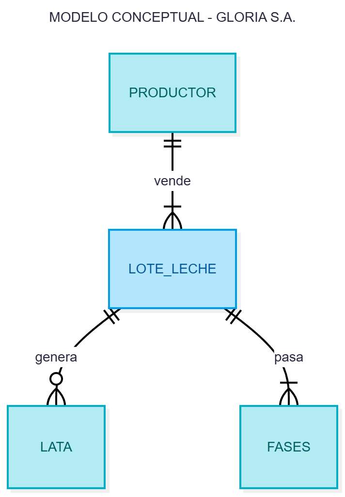
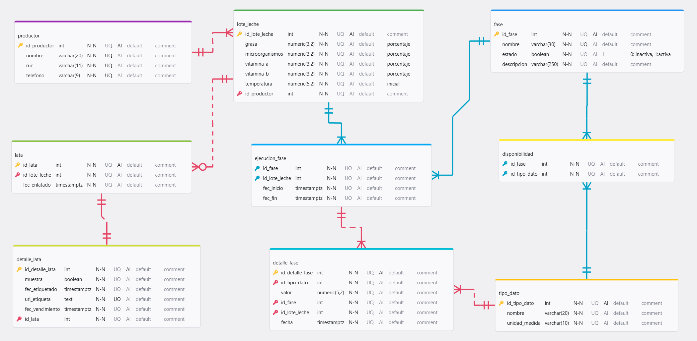

# Propuesta de mejora del proceso "Producción de leche evaporada" en GLORIA S.A.

## 1. Descripción del proyecto
Este repositorio muestra la propuesta de mejora del proceso de "Producción de leche evaporada" en GLORIA S.A., a partir del marco TOGAF. Es por ello que, la propuesta se desarrolla en capas.

## 2. Estado del proyecto

## 3. Tecnologías utilizadas

## 4. Desarrollo del proyecto
### Modelo conceptual

    

### Modelo lógico

## 5. Licencia
